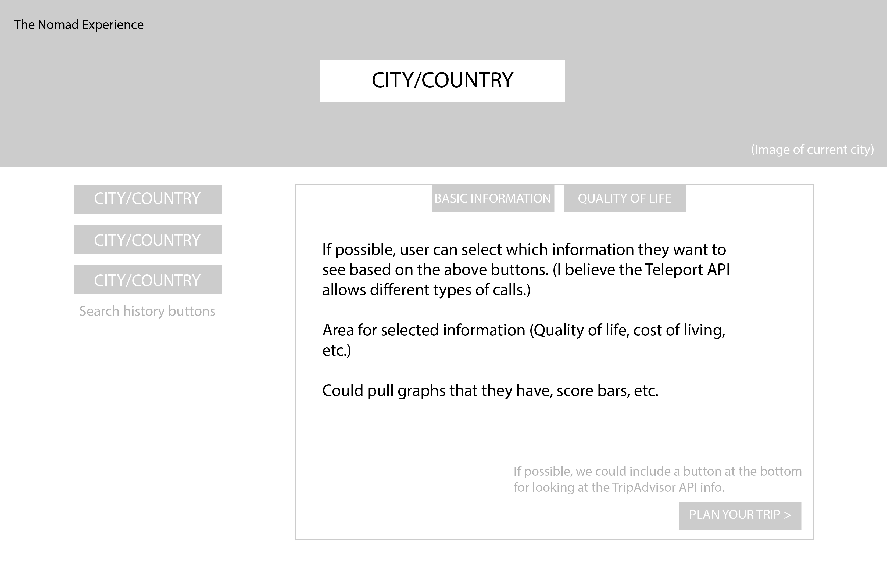
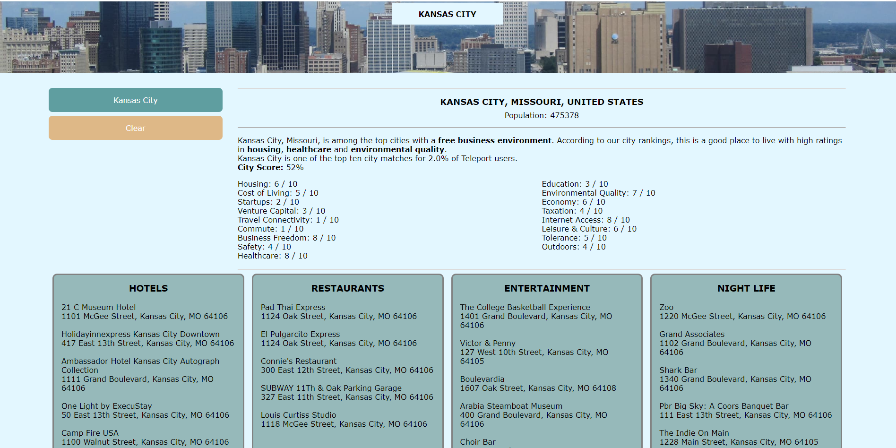

# The Nomad Experience

# Application Description:
An application that provides basic information and local attractions about a selected city.

# Deployed Application Link:

# Technology Used:
HTML
CSS
JavaScript
API

# Contributors:
Ashleigh Pfander
Ryan McElwee

# User Story
AS A traveler
I WANT to view basic information about a city I may visit
SO THAT I can learn about the city's Quality of Life and view nearby hotels, restaurants, entertainment and night life.

# Our Starting Wireframe:
First page wireframe for picking your city.

Second page wireframe for booking your flight.

# Final Results:
Initial page load

Example for the page with the search box opened

Result from a search

